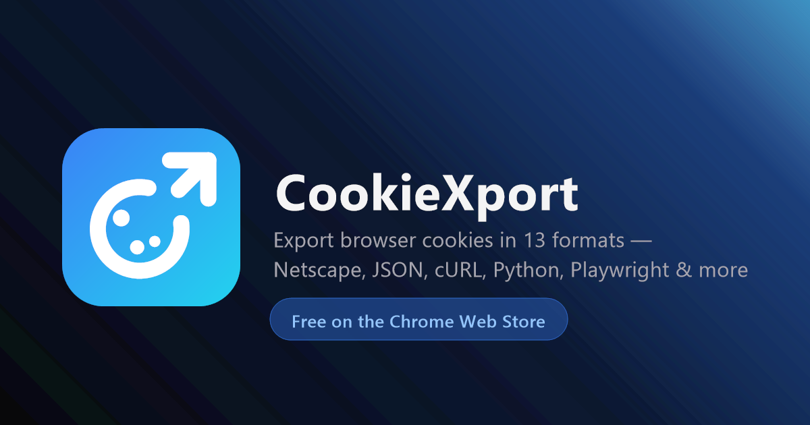

# CookieXport

**Take the cookies you already have in your browser and get them out in the shape your tool expects.**
A cURL command, a Playwright script, a Netscape cookie jar — 13 formats, one click. Entirely on your device: no server, no account, no network calls.

[**Website**](https://cookiexport.mtvrkan.com/) · [**Install**](INSTALL.md) · [**Privacy policy**](https://cookiexport.mtvrkan.com/privacy) · [**Changelog**](CHANGELOG.md) · **[Türkçe](README.tr.md)**

---

Copying a session out of a browser is a chore everyone solves badly. You open DevTools, squint at the Application tab, hand-assemble a `Cookie:` header, and get it subtly wrong. CookieXport reads the cookies for the site you are on and hands you a snippet that already works in the tool you were headed to.

Nothing leaves the machine. There is no backend to leave it to.

## What you get

- **13 export formats** — from a plain cookie jar to a fully-formed Playwright script, listed below
- **Instant domain detection** — the popup opens already scoped to the active tab, no pasting URLs
- **22 quick presets** — YouTube, Netflix, X, GitHub, Discord and more, one click away
- **Filters and full-text search** — narrow by Secure, HttpOnly, session, or expiring soon, and search names and values as you type
- **Multi-domain export** — select several sites and export them together in one file
- **Import** — load a `.txt` or `.json` cookie file back into the browser
- **Local export history** — the last 25 exports, re-downloadable or re-copyable, stored on your device
- **10 languages**, light and dark theme, and a right-click shortcut on any page

## The formats

- **Netscape** `.txt` — the classic cookie jar, for `wget`, `curl`, `yt-dlp` and most CLI downloaders
- **JSON** `.json` — every cookie with its full metadata
- **cURL** `.sh` — a ready-to-paste command with the `Cookie` header built in
- **Header string** — just the `name=value; name=value` line
- **Python requests** `.py` — a complete script with the session already set up
- **Node.js fetch** `.js` — an async-ready snippet, with the axios variant alongside
- **Playwright** `.js` — an `addCookies()`-ready array
- **Puppeteer** `.js` — a `setCookie()`-ready array
- **Selenium** `.py` — `driver.add_cookie()` calls, navigation included
- **PHP cURL** `.php` — `curl_setopt_array` with the cookie string
- **Go net/http** `.go` — `req.AddCookie()` calls
- **HAR** `.har` — a valid HTTP Archive 1.2 entry
- **Base64** — the JSON export, encoded for safe transport
- **Custom template** — your own string, built from `{{name}}`, `{{value}}`, `{{domain}}`, `{{path}}`, `{{expires}}`, `{{expiresISO}}`, `{{secure}}` and `{{httpOnly}}`

Values go out exactly as the browser stores them, and each format escapes for its own target language — a JWT ending in `==`, or a value with a quote in it, will not break the snippet it lands in.

## How it works

1. Open the popup on any site. CookieXport reads the active tab's domain and lists its cookies, masked by default.
2. Filter, search, tick what you need, and pick the tool you are exporting to.
3. Copy the generated snippet or download the file. Either way it is also saved to your local history.

## Privacy

CookieXport makes zero network requests of its own. Cookie data, preferences and export history stay in `chrome.storage.local` on your device and are never synced, sold or shared. There is no analytics, no remote code, and no account.

Cookies are read strictly on demand — when you press Export, Copy, or use the right-click menu — and are only written when you explicitly apply an import. You can verify all of it: open DevTools → Network while using the extension and watch nothing happen.

The full policy, including why each permission is needed, is at [cookiexport.mtvrkan.com/privacy](https://cookiexport.mtvrkan.com/privacy).

## Contributing

Issues and pull requests are welcome. Keep changes small and focused, match the surrounding style (2-space indent, no semicolons), and never add a dependency or a network call — the zero-telemetry guarantee is the whole point.

There are no dependencies, no build step and no bundler. Cloning the repo, loading `src/` unpacked and reloading after an edit are all covered in [INSTALL.md](INSTALL.md).

## More

[Install guide](INSTALL.md) · [Changelog](CHANGELOG.md) · [Report an issue](https://github.com/mtvrkan/cookiexport/issues) · [Extension source](src) · [Landing page source](docs)

## License

MIT — see [LICENSE](LICENSE). Covers the extension and the landing page; the CookieXport name and logo stay tied to the official listing.
