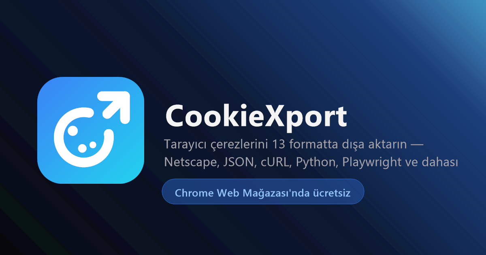

# CookieXport

**Tarayıcınızda hâlihazırda duran çerezleri alın, kullandığınız aracın beklediği biçimde dışarı çıkarın.**
Bir cURL komutu, bir Playwright script'i, bir Netscape çerez dosyası — 13 format, tek tık. Tamamı cihazınızda: sunucu yok, hesap yok, ağ isteği yok.

[**Web sitesi**](https://cookiexport.mtvrkan.com/tr/) · [**Kurulum**](INSTALL.md) · [**Gizlilik politikası**](https://cookiexport.mtvrkan.com/tr/privacy) · [**Değişiklikler**](CHANGELOG.md) · **[English](README.md)**

---

Bir oturumu tarayıcıdan çıkarmak herkesin kötü çözdüğü bir angarya. DevTools'u açar, Application sekmesinde gözlerinizi kısar, `Cookie:` başlığını elle birleştirir ve fark etmediğiniz bir yerde yanlış yaparsınız. CookieXport bulunduğunuz sitenin çerezlerini okur ve gitmek üzere olduğunuz araçta doğrudan çalışan bir çıktı verir.

Hiçbir şey makineden çıkmıyor. Çıkacağı bir arka uç da yok.

## Neler var

- **13 dışa aktarma formatı** — düz bir çerez dosyasından tam çalışan bir Playwright script'ine kadar, aşağıda listeli
- **Anında domain algılama** — açılır pencere zaten etkin sekmenin kapsamıyla açılır, URL yapıştırmak yok
- **22 hızlı hazır site** — YouTube, Netflix, X, GitHub, Discord ve dahası, tek tık uzağınızda
- **Filtreler ve tam metin arama** — Secure, HttpOnly, oturum veya süresi yaklaşan çerezlere göre daraltın; adlarda ve değerlerde yazdıkça arayın
- **Çoklu domain aktarımı** — birden fazla siteyi seçip tek dosyada birlikte aktarın
- **İçe aktarma** — bir `.txt` veya `.json` çerez dosyasını tarayıcıya geri yükleyin
- **Yerel aktarım geçmişi** — son 25 aktarım, tekrar indirilebilir veya kopyalanabilir, cihazınızda saklanır
- **10 dil**, açık ve koyu tema, ve her sayfada sağ tık kısayolu

## Formatlar

- **Netscape** `.txt` — klasik çerez dosyası; `wget`, `curl`, `yt-dlp` ve çoğu komut satırı indiricisi için
- **JSON** `.json` — her çerez, tüm üst verisiyle
- **cURL** `.sh` — `Cookie` başlığı hazır gelen, yapıştırıp çalıştırılabilir komut
- **Header string** — yalnızca `ad=değer; ad=değer` satırı
- **Python requests** `.py` — session'ı kurulmuş halde gelen tam script
- **Node.js fetch** `.js` — async'e hazır snippet, yanında axios varyantı
- **Playwright** `.js` — `addCookies()` için hazır dizi
- **Puppeteer** `.js` — `setCookie()` için hazır dizi
- **Selenium** `.py` — `driver.add_cookie()` çağrıları, gezinme dahil
- **PHP cURL** `.php` — çerez dizesiyle `curl_setopt_array`
- **Go net/http** `.go` — `req.AddCookie()` çağrıları
- **HAR** `.har` — geçerli bir HTTP Archive 1.2 kaydı
- **Base64** — JSON çıktısının güvenli taşıma için kodlanmış hali
- **Özel şablon** — `{{name}}`, `{{value}}`, `{{domain}}`, `{{path}}`, `{{expires}}`, `{{expiresISO}}`, `{{secure}}` ve `{{httpOnly}}` ile kurduğunuz kendi diziniz

Değerler tarayıcının sakladığı biçimde çıkar ve her format kendi hedef diline göre kaçış uygular — `==` ile biten bir JWT ya da içinde tırnak olan bir değer, düştüğü snippet'i bozmaz.

## Nasıl çalışır

1. Herhangi bir sitede açılır pencereyi açın. CookieXport etkin sekmenin domainini okur ve çerezlerini varsayılan olarak maskeli listeler.
2. Filtreleyin, arayın, istediklerinizi işaretleyin ve aktaracağınız aracı seçin.
3. Üretilen snippet'i kopyalayın veya dosyayı indirin. Her iki durumda da yerel geçmişinize kaydedilir.

## Gizlilik

CookieXport kendi başına hiçbir ağ isteği yapmaz. Çerez verisi, tercihler ve aktarım geçmişi cihazınızdaki `chrome.storage.local` içinde kalır; hiçbir zaman senkronlanmaz, satılmaz veya paylaşılmaz. Analitik yok, uzaktan kod yok, hesap yok.

Çerezler yalnızca istendiğinde okunur — Dışa Aktar'a veya Kopyala'ya bastığınızda ya da sağ tık menüsünü kullandığınızda — ve yalnızca bir içe aktarmayı açıkça uyguladığınızda yazılır. Hepsini doğrulayabilirsiniz: eklentiyi kullanırken DevTools → Network'ü açın ve hiçbir şey olmadığını izleyin.

Her iznin neden gerekli olduğu dahil politikanın tamamı: [cookiexport.mtvrkan.com/tr/privacy](https://cookiexport.mtvrkan.com/tr/privacy).

## Katkı

Issue ve pull request'ler memnuniyetle karşılanır. Değişiklikleri küçük ve odaklı tutun, çevredeki stile uyun (2 boşluk girinti, noktalı virgül yok) ve asla bir bağımlılık veya ağ isteği eklemeyin — sıfır telemetri garantisi bu işin bütün amacı.

Bağımlılık yok, derleme adımı yok, bundler yok. Depoyu klonlamak, `src/` klasörünü paketlenmemiş olarak yüklemek ve bir düzenlemeden sonra yeniden yüklemek — hepsi [INSTALL.md](INSTALL.md) içinde (İngilizce).

## Daha fazla

[Kurulum rehberi](INSTALL.md) · [Değişiklikler](CHANGELOG.md) · [Sorun bildir](https://github.com/mtvrkan/cookiexport/issues) · [Eklenti kaynağı](src) · [Site kaynağı](docs)

## Lisans

MIT — bkz. [LICENSE](LICENSE). Eklentiyi ve tanıtım sayfasını kapsar; CookieXport adı ve logosu resmî listelemeye bağlı kalır.
